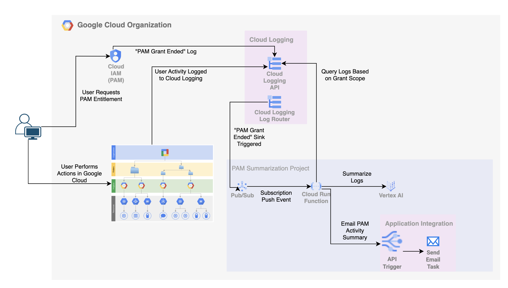
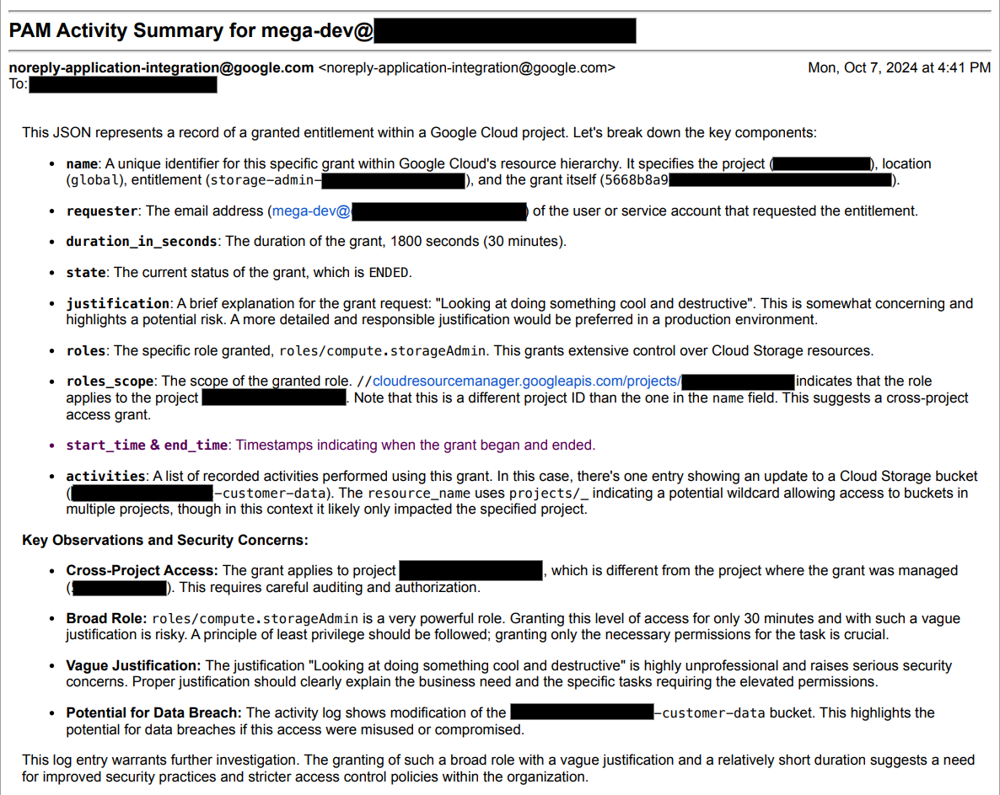

# Google Cloud PAM Activity Summary - Terraform
This project aims to provide a tool for summarizing user activity that occurred during a grant issued by Google Cloud's [Privileged Access Manager (PAM)](https://cloud.google.com/iam/docs/pam-overview) service. Google Cloud's PAM provides just-in-time privileged access management, allowing for temporary elevation of permissions with comprehensive audit logs. However, analyzing these audit logs to understand the actions taken during a specific grant can be time-consuming.

The goal of this project is to:
- Fetch PAM Grant Information: Retrieve details about specific PAM grants, including the granted roles, resources, and timeframes.
- Collect Audit Logs: Analyze Google Cloud audit logs to identify events related to the specified grant.
- Summarize User Activity: Generate a concise summary of the actions performed by the user during the grant period.
- Send a Notification: Email a summary of the activty to a user/group in the organization responsible for periodically reviewing user activity.

### Architecture



### Setup PAM Summarization Project
```bash
#Setup Variables
export PROJECT_NAME=[PROJECT_NAME]
export REGION=[REGION] e.g. us-central1
export ORGANIZATION_ID=[ORG_ID]
export BILLING_ACCOUNT=[BILLING_ID]

if [ -z "${PROJECT_ID}" ]
then
  PROJECT=$(gcloud projects list --filter=name:${PROJECT_NAME})
  if [ -z "${PROJECT}" ]
  then
    RANDOM_PROJECT_SUFFIX=$(cat /dev/urandom | tr -dc 'a-z0-9' | fold -w 6 | head -n 1)
    printf 'Y' | gcloud projects create ${PROJECT_NAME}-${RANDOM_PROJECT_SUFFIX} --name=${PROJECT_NAME} --organization=${ORGANIZATION_ID}
    while [[ -z "${EXISTS}" ]]; do
      EXISTS=$(gcloud projects list --filter=name:${PROJECT_NAME} --format 'value(PROJECT_ID)')
      sleep 1
    done
  fi
  export PROJECT_ID=$(gcloud projects list --filter=name:${PROJECT_NAME} --format 'value(PROJECT_ID)')
  export PROJECT_NUMBER=$(gcloud projects list --filter=name:${PROJECT_NAME} --format 'value(PROJECT_NUMBER)')
fi
gcloud beta billing projects link ${PROJECT_ID} --billing-account=${BILLING_ACCOUNT}

gcloud config set project ${PROJECT_ID}

gcloud auth application-default set-quota-project ${PROJECT_ID}
```

### Setup Remote State
```bash
cd remote-state
terraform init && terraform apply -var="project_id=${PROJECT_ID}"
cd ..
```

### Update Variables 
```bash
cp terraform.example.tfvars terraform.tfvars
#Update terraform.tfvars
```

### Run Terraform
```bash
terraform init
terraform plan
terraform apply
```

### Create Application Integration Specification for Email Summaries
```bash
#Create Application Integration in Region
curl -X POST \
-H "authorization: Bearer $(gcloud auth print-access-token)" \
-H "Content-Type: application/json" \
"https://$REGION-integrations.googleapis.com/v1/projects/$PROJECT_ID/locations/$REGION/clients:provision"

#Upload Specification and Publish
uploaded_spec="$(curl --silent -X POST \
-H "authorization: Bearer $(gcloud auth print-access-token)" \
-H "Content-Type: application/json" \
-d @application_integration_config.json \
"https://$REGION-integrations.googleapis.com/v1/projects/$PROJECT_ID/locations/$REGION/integrations/pam-summary-email/versions")"

version=$(echo ${uploaded_spec} | jq -r .name | sed 's:.*/::')

curl -X POST \
-H "authorization: Bearer $(gcloud auth print-access-token)" \
-H "Content-Type: application/json" \
"https://$REGION-integrations.googleapis.com/v1/projects/$PROJECT_ID/locations/$REGION/integrations/pam-summary-email/versions/$version/:publish"
```

### Alternatives Considered
- Establish a real-time Log Router Sink at the appropriate level of the grant (project/folder/organization) and direct all user-specific logs to Bigquery.
    - Latency in collecting logs after the grant was enabled, combined with the lack of ability to pull logs retroactively, made this option not optimal
- Use the Log Copy to Cloud Storage option and then move logs from Cloud Storage to Bigquery
    - This option cannot be used for Log Storage buckets which have CMEK keys and also is limited to one copy operation per project at a time.

### License:

This is not an official Google Product.

This project is licensed under the MIT License.